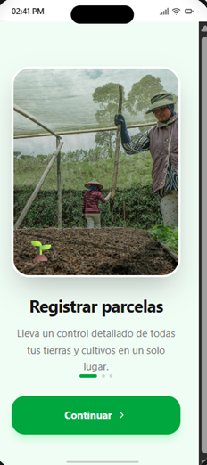
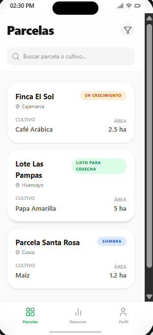
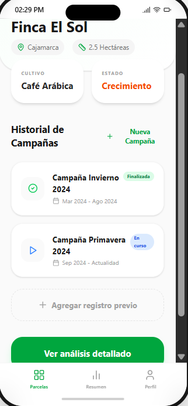
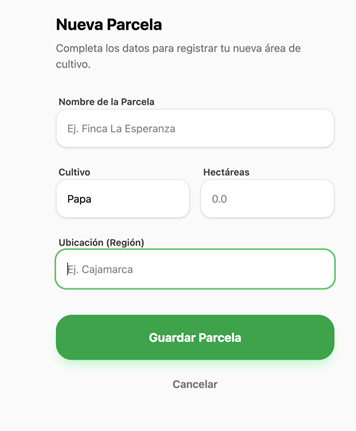
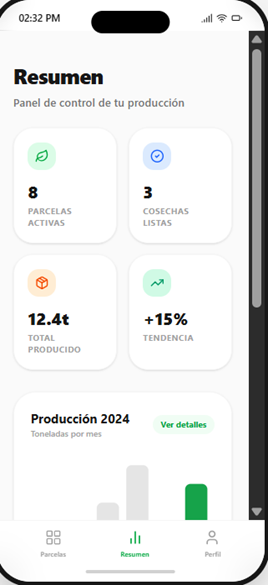
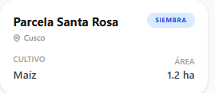

# AgroCampo 🌱

App iOS para el registro de parcelas y seguimiento de campañas agrícolas en el Perú

---

## 👥 Integrantes del equipo

- Chunga Malque Marco
- Vasquez Sanchez Antonio 
- Vasquez Montes Alexander 
- Alcocer Flores Alexander 
- Pinto Quispe Kelvin 

---

## 📌 Brief asignado

El proyecto **AgroCampo** responde a la necesidad de una cooperativa de pequeños agricultores de la sierra y selva alta del Perú que requieren una herramienta digital sencilla para gestionar sus cultivos.

Actualmente, muchos agricultores no cuentan con acceso constante a internet, lo que dificulta el uso de plataformas tradicionales. Además, existe una creciente exigencia internacional de trazabilidad agrícola, lo que hace necesario registrar información de parcelas y campañas de cultivo.

La aplicación permite:

* Registrar parcelas agrícolas
* Gestionar campañas (siembra y cosecha)
* Consultar cultivos activos rápidamente
* Funcionar completamente sin conexión a internet

El usuario principal es el **agricultor familiar peruano**, que necesita una solución simple, rápida y accesible desde su celular.

---

## 🎯 Objetivo del MVP

Desarrollar una aplicación móvil iOS funcional que permita a los agricultores:

* Registrar y administrar sus parcelas
* Registrar campañas de cultivo por parcela
* Visualizar el estado de sus cultivos activos
* Consultar información histórica de campañas
* Utilizar la app sin conexión a internet

El MVP busca resolver el problema de organización y seguimiento de cultivos de forma simple e intuitiva.

---

## 📱 Funcionalidades implementadas

* ✅ Registro de parcelas (nombre, cultivo, área, ubicación)
* ✅ Registro de campañas (fechas, producción estimada, estado)
* ✅ Lista de parcelas con indicador visual del estado actual
* ✅ Detalle de parcela con historial de campañas
* ✅ Onboarding inicial (solo en la primera ejecución)
* ✅ Perfil básico del usuario (datos del agricultor)

---

## 🧭 Navegación de la app

La aplicación implementa diferentes tipos de navegación exigidos:

* **TabBarController**
  Navegación principal entre:

  * Lista de parcelas
  * Resumen
  * Perfil

* **NavigationController (Push)**
  Navegación hacia el detalle de una parcela

* **Modal**
  Formularios para:

  * Registrar parcela
  * Registrar campaña
  * Onboarding inicial

Esto permite una experiencia de usuario clara y estructurada.

---

## 🧱 Arquitectura y decisiones técnicas

### 1. Uso de UserDefaults para el onboarding

Se utiliza `UserDefaults` para almacenar si el usuario ya ha abierto la aplicación anteriormente.

**Justificación:**

* Es un mecanismo ligero y persistente
* Ideal para datos simples (booleanos)
* Permite mostrar el onboarding solo una vez

**Limitación:**

* No es adecuado para almacenar datos complejos o sensibles

---

### 2. Modelado de datos: Parcela y Campaña

Se implementa una relación de composición donde:

* Una **Parcela** contiene múltiples **Campañas**

**Justificación:**

* Representa correctamente la lógica del negocio
* Facilita la gestión de datos relacionados
* Mejora la organización del código

---

### 3. Uso de UIKit como base principal

La app se desarrolla utilizando UIKit para la construcción de interfaces.

**Justificación:**

* Permite mayor control sobre la navegación
* Cumple con los requisitos de la práctica
* Facilita el uso de componentes como TableView y NavigationController

---

### 4. (Bonus) Uso de SwiftUI

Se implementa una pantalla utilizando SwiftUI (por ejemplo, el resumen).

**Justificación:**

* Permite una construcción declarativa de la UI
* Reduce código en interfaces simples
* Mejora la mantenibilidad

---

## 🖼️ Screenshots

### Onboarding

### Pantalla principal

### Detalle de parcela

### Formulario

### Resumen

### Perfil

---

## 🎨 Diseño (Boceto)

El diseño previo fue realizado como parte obligatoria del proceso:

* 🎨 Figma: [https://www.figma.com/make/nWmKufoId4tVEGMkvEe0Io/Dise%C3%B1o-UI-UX-AgroCampo-iOS?code-node-id=0-9&p=f&fullscreen=1]

---

## ⚙️ Tecnologías usadas

* Swift
* UIKit
* SwiftUI (bonus)
* Xcode
* UserDefaults

---

## 🚀 Cómo ejecutar el proyecto

1. Clonar el repositorio
2. Abrir el proyecto en Xcode
3. Ejecutar en un simulador o dispositivo iOS

---

## 📊 Estado del proyecto

* ✅ MVP funcional
* ✅ Navegación completa implementada
* ✅ Funciona sin conexión a internet
* ✅ Sin errores críticos (crashes)

---

## 🧠 Problemas encontrados

* Implementación del onboarding solo en la primera ejecución
* Modelado correcto de la relación entre Parcelas y Campañas
* Gestión de navegación entre múltiples pantallas

---

## 📌 Conclusiones

El desarrollo del proyecto permitió aplicar conceptos clave de desarrollo iOS como navegación, arquitectura y persistencia básica de datos.

Se logró construir un MVP funcional enfocado en resolver una necesidad real del contexto agrícola peruano. Como mejora futura, se podría integrar almacenamiento persistente más robusto o sincronización en la nube.

---
